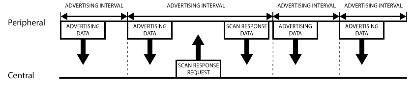
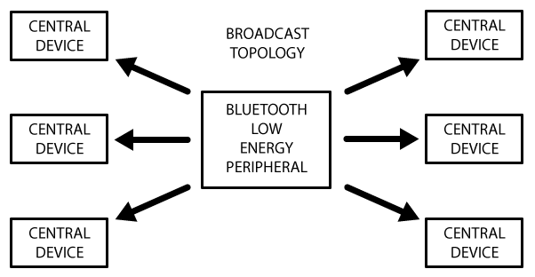

# ESP32 NimbleBLE

## Concept

[Introduction to Bluetooth Low Energy](https://learn.adafruit.com/introduction-to-bluetooth-low-energy/introduction)

低功耗蓝牙 （BLE）是经典蓝牙的轻量级子集，作为蓝牙 4.0 核心规范的一部分引入。 虽然与传统蓝牙有一些重叠，但 BLE 实际上具有完全不同的血统，并且由诺基亚作为一个名为“Wibree”的内部项目启动，然后被蓝牙 SIG 采用。

### 1. GAP

GAP 是 Generic Access Profile 的首字母缩写词，它控制蓝牙中的连接和广播。GAP 使您的设备对外界可见，并决定两台设备如何能够（或不能）相互交互。

#### 1.1  Device Roles

GAP 为设备定义了各种角色，但要记住的两个关键概念是 Central 和 Peripheral

* **Peripheral** 是小型、低功耗、资源受限的设备，可以连接到功能更强大的中央设备。外围设备包括心率监测器、支持 BLE 的近场标签等

* **Central** 通常是您连接的移动电话或平板电脑，具有更强的处理能力和内存

#### 1.2 Advertising and Scan Response Data

有两种方法可以使用 GAP 发送广播。 Advertising Data 负载和 Scan Response 负载。

两个数据是相同的，最多可以包含 31 字节的数据，但只有广播数据是必需的，因为这是从设备不断传输出去的数据，以让范围内的中央设备知道它的存在。 扫描响应负载是中央设备可以请求的可选辅助负载，并允许设备设计人员在广播负载中加入更多信息，例如设备名称的字符串等。

#### 1.3 Advertising Process

外围设备在设置的周期内发送广播数据包，间隔设置越长越省电，但会使响应速度变慢。

如果侦听设备对扫描响应有效载荷感兴趣（并且在外围设备上可用），它可以选择请求扫描响应有效载荷，并且外围设备将使用其他数据进行响应。

#### 1.4 Broadcast Network Topology

虽然大多数外围设备都会公布自身，以便建立连接，并且可以使用 GATT 服务和特征（这允许在两个方向上交换更多的数据），但在某些情况下，您只想公布数据。

这里的主要用例是您希望外围设备一次将数据发送到多个设备。这只能使用广播数据包，因为在连接模式下发送和接收的数据只能由这两个连接的设备看到。

通过在 31 字节广播或扫描响应负载中包含少量自定义数据，您可以使用低成本的低功耗蓝牙外围设备将数据单向发送到侦听范围内的任何设备，如下图所示。 这称为低功耗蓝牙广播。

例如，Apple 的 iBeacon 就采用这种方法，它使用 Manufacturer Specific Data 字段在主广告数据包中插入自定义负载。

在外围设备和中央设备之间建立连接后，广告过程通常会停止，您通常无法再发送广告数据包，您将使用 GATT 服务和特性进行双向通信。

### 2. GATT

GATT 是 Generic Attribute Profile 的首字母缩略词,它定义了两个蓝牙低功耗设备使用称为 Services 和 Characteristics 的概念来回传输数据的方式。它使用称为  Attribute Protocol (ATT) 的通用数据协议,该协议用于将 Services, Characteristics 和相关数据存储在简单的查找表中,使用表中每个条目的16位ID。

### Services

### Characteristics
